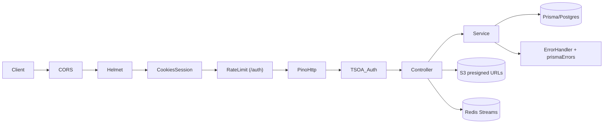
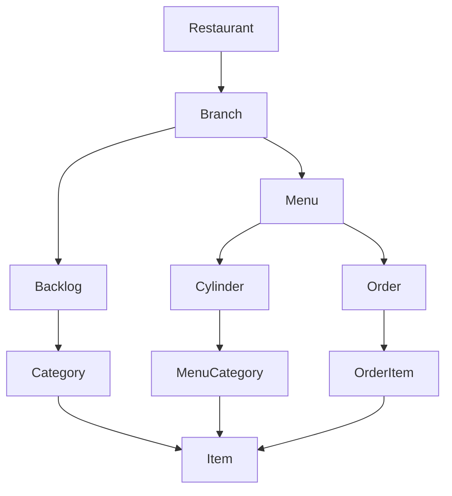
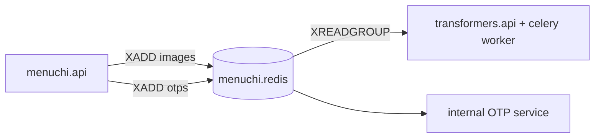

# MenuChi Backend — Architecture

> Stack: Express 4 + TSOA + Prisma (Postgres) + Redis + S3. Node 22.
> Entry: `src/index.ts` → `src/server.ts` (`createServer`) → `src/routes.ts` (TSOA-generated).

## 1. Request flow

- `src/server.ts`: `helmet`, CORS from `MENUCHI_FRONT_URL`, `pino-http` with `req.id` (`crypto.randomUUID`), `cookie-parser`, `express-session` + `connect-redis`, `/docs` (Swagger UI), `RegisterRoutes`, then `notFoundHandler` → `errorPreprocessor` → `errorHandler`.
- DI: `src/container.ts` (`createContainer` / `resolveContainer(req)`). Controllers are thin; business logic lives in `src/services/*`.
- Errors: `src/exceptions/*` (`MenuchiError` base with `status` + numeric `code`) mapped in `src/middlewares/ErrorHandler.ts` + `src/utils/prismaErrors.ts` (P2002 → 409, P2025 → 404).

## 2. Dual auth: session-cookie vs JWT

| Path | Mechanism | Where |
|------|-----------|-------|
| Restaurant owner | `express-session` + Redis store, `access-token` httpOnly cookie | `AuthController.res-signin`, `SessionConfig.ts`, `middlewares/Auth.ts` |
| Owner JWT | `access-token` JWT verified per-request (stateless fallback) | `BaseController.checkPermission`, `AuthService.generateAuthToken` |
| Customer | Email OTP → session `user.id = email`, role `RestaurantCustomer` | `AuthController.checkOtp/sendOtp` |

Why both: cookies give revokable browser sessions for owners; JWT keeps customer/order calls stateless. `trust proxy: 1` enables `Secure` cookies behind Docker/Nginx. AuthZ is scope-based (`PermissionScope.Menu/Branch/Restaurant`) in `BaseController`.

## 3. Domain model: Backlog vs Menu/Cylinder

- **Backlog** (`Restaurant → Branch → Backlog → Categories → Items`): draft pool. Creating a restaurant auto-creates default branch + backlog.
- **Menu publishing** (`Branch → Menu → Cylinder → MenuCategory → Items`): a `Cylinder` is a day-combination (e.g. Mon–Fri, weekend) controlling availability. Categories are reused from backlog per cylinder; unused items stay in backlog.
- **Orders** (`Menu → Order → OrderItem`): customers order against a published menu; owners manage via dashboard (`DashboardService`).

See `src/db/schema.prisma` and [DBDiagram](https://dbdiagram.io/d/menuchi-db-67d2dbb575d75cc844f75bb6).

## 4. Redis Streams: images / otps

- Connections: `REDIS_URL` (sessions, db 0), `TRANSFORMERS_REDIS_URL` (db 1, stream `images`), `OTP_REDIS_URL` (db 2, stream `otps`). Factory in `src/config/redisFactory.ts`; clients in `src/config/*RedisClient.ts`.
- Producers: `S3Controller`/image events (`src/events/imageEvents.ts`), `AuthController.sendOtp`.
- Health: `/ready` checks `prisma.$queryRaw SELECT 1` + `redis.ping`; Docker `HEALTHCHECK` hits `/health`; compose gates on `psql`/`redis` healthy.

## 5. Config, observability, deploy

- Env: single zod source `src/config/env.ts` (`PORT` default `8000`, fail-fast). `dotenv.config` once in `env.ts`; `.env.example` is the documented template.
- Logging: `pino` + `pino-http` (`src/lib/logger.ts`); no `console.log` in request path. Graceful shutdown in `src/index.ts` (`SIGTERM/SIGINT` → `server.close`, `prisma.$disconnect`, `redis.quit`).
- Build: 3-stage `Dockerfile` (`deps/build/runtime`), non-root `app`, `HEALTHCHECK /health`. Cold start: `entrypoint.sh` retries `prisma db push` until Postgres is ready (dev). Prod should use `prisma migrate deploy` once migrations exist.
- CI: single `.github/workflows/ci.yml` — `lint + typecheck + format:check` → `db-push` → `test:coverage`, then branch-aware Docker tags (`:stable` from `main`, `:dev` from `dev`).
